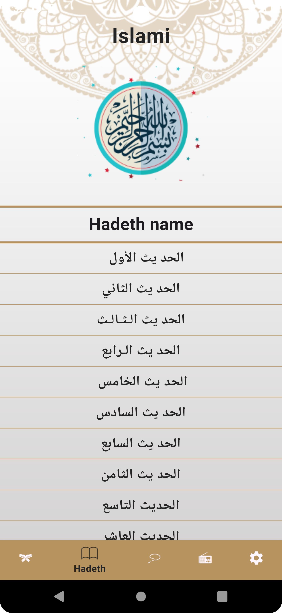

# islami_app

A comprehensive Flutter application designed to offer Islamic content such as Quranic chapters,
Hadiths, and a digital prayer beads tool. The app supports multi-language functionality (Arabic and
English), theming (Dark and Light mode), and additional features like API integration for Islamic
radio.

## Features

- **Quran Display**: View and read Surahs from the Quran.
- **Hadith Display**: Browse and read Hadiths.
- **Tasbeeh (Prayer Beads)**: Digital Tasbeeh tool with rotating beads. After 31 presses, a new
  Adhkar is displayed.
- **Settings Screen**: Customize the app's language (Arabic/English) and theme (Dark/Light).
- **Multilingual Support**: English and Arabic languages available.
- **Theming Support**: Light and Dark mode with splash screens for both.
- **Bottom Navigation**: Easy navigation between Quran, Hadith, Tasbeeh, and Settings screens.
- **State Management**: Managed with Provider.
- **Radio API**: Integrated API to listen to Islamic radio.
- **File Reading**: Read Quranic and Hadith content from internal files.

## Technologies Used

- **Flutter**: Cross-platform mobile framework.
- **Dart**: Programming language for Flutter.
- **Provider**: State management solution.
- **Localization**: Supports English and Arabic languages.
- **API Integration**: Islamic radio using REST API.

## Getting Started

To run the application locally, follow these steps:

1. Clone the repository:
   ```bash
   git clone https://github.com/yourusername/islami_app.git

## Screenshots

### Light Mode





### Dark Mode


